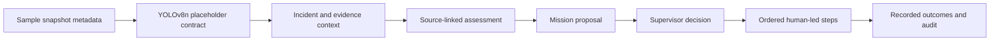

# Security OS: vision evidence to human response

NOVA now treats an incident as the start of a response workflow. Command brings the incident, linked snapshots, permitted case context, unknowns, and a matched procedure into one workspace. Missions hold the supervisor's decision and each subsequent operator outcome. Playbooks describe four built-in starter procedures; Systems shows the actual connection state.

## What the engine does today

The requested foundation is YOLOv8n. This release deliberately uses placeholders: `shared/vision-engine.js` reads existing sample detection metadata and never loads weights or performs inference. Labels such as `person-group`, `vehicle`, and campus rule names come from the fixtures; they are not claims about YOLOv8n's standard class vocabulary. Detection percentages describe fixture object labels, not incident risk or confidence in a security conclusion.

Assessments are deterministic templates derived from source records and the playbook catalog. Each observation cites an allowed source ID; unknown source IDs or procedure IDs fail validation. Free-form chat, a cloud model, and arbitrary generated actions are absent. The three intents provide situation assessment, response planning, and handover wording. Every output identifies itself as sample/placeholder.

## Decisions and state

- Any authenticated role can assess an incident and prepare a mission. Guards see only runs they created and missions associated with those runs; other roles see workspace runs. Guard assessments never include case records.
- One mission can be created per assessment; retrying proposal returns the existing mission.
- A new proposal or approval requires an unresolved incident and an assessment no older than 15 minutes. The server compares incident fields, source content/timestamps, snapshot metadata, and detection boxes against the captured context. Changed or expired context requires a new assessment. An expired proposal can still be declined.
- Supervisor/admin approval requires a note and changes `pending-approval` to `active`. Declining changes it to `rejected`. A decided mission cannot be approved twice.
- Only an active mission progresses. Operators record a nonempty outcome for the next pending step in catalog order. The last step sets the mission to `completed`. A resolved incident blocks further progression.
- Completing a mission does not change incident or case status. Operators retain those separate decisions.
- A procedure may request radio coordination, but NOVA does not contact a team, dispatch an officer, manipulate a gate, or alter an access system.

The catalog is fixed in `shared/security-engine.js`. Starter procedures require supervisor review against campus policy; the interface does not label them approved campus policies.

## Persistence and capacity

API mode stores `security.runs` and `security.missions` inside the existing local database. Older files receive empty collections in memory and retain their existing records. Assessment, decision, and step events are appended to the incident's audit trail in the same atomic save. Failed writes restore the prior in-memory state. Existing simulator cases may have up to 100,000 linked IDs; creating a case still permits at most 100 per request.

Browser sample mode stores runs, missions, and their activity together in `nova.security-os.v1`. Failed or oversized writes do not change the saved workflow. Cross-tab storage events refresh the views. Activity is merged into Audit Log. Corrupt workflow records produce a recovery error instead of being silently replaced.

Each mode accepts up to 500 runs and 500 missions. Browser activity is capped at 5,000 entries with an 8-million-character storage bound; the API retains its 32 MB database limit. Capacity errors preserve existing records. There is no archival UI in this release: administrators must export/back up and manage retention before reaching these bounds. Local storage is for preview; the API database is single-process and requires managed shared storage before multi-site deployment.

## API contract

All routes require a verified session. POST routes also require an allowed Origin, CSRF token, and bounded JSON body. Actor and role come from the session.

| Method | Path | Body / result |
| --- | --- | --- |
| GET | `/api/security` | Visible runs, missions, and engine readiness |
| POST | `/api/security/assessments` | `{ incidentId, intent? }`; saved run (201) |
| POST | `/api/security/missions` | `{ runId }`; prepared or existing mission |
| POST | `/api/security/missions/:id/decision` | `{ decision: "approve" \| "reject", note }`; supervisor/admin only |
| POST | `/api/security/missions/:id/steps/:stepId` | `{ note }`; record the next approved step |

Unknown request fields are rejected. IDs are bounded, encoded in browser transport, and validated on the server. Approval and step notes are capped at 2,000 characters. Output validation controls references and procedure order; records are displayed as text without HTML execution.

## Future YOLOv8n adapter boundary

`validateVisionFrame` defines the narrow frame metadata boundary: a camera ID, a valid recorded timestamp, and at most 100 object detections. Labels are bounded; confidence must be finite and within 0–1; boxes must have positive dimensions, normalized coordinates, and remain within the frame.

A real adapter should run locally in a separate vision service, map its supported class vocabulary, authenticate camera ingestion, write evidence through a reviewed ingest API, and retain explicit model/version/provenance. It must distinguish object observations from campus rules and human incident classifications. There is no live ingest endpoint or adapter process in this release. No camera or model credentials are required for this placeholder.

Before shipping a real Ultralytics model, confirm the applicable distribution/license terms and the campus deployment requirements. Keep inference provenance, retention, and human decision boundaries visible when replacing placeholders.

## Verification

`npm run test:security-os` exercises source grounding, invalid vision boxes, role-limited context, proposal idempotency, approval permissions, sequential steps, resolved/expired/changed context, actual HTTP auth/CSRF boundaries, write rollback, restart persistence, sample browser storage, corrupt records, and activity history. CI runs it with the existing operations, API, resilience, lint, build, token, and dependency audit checks.
